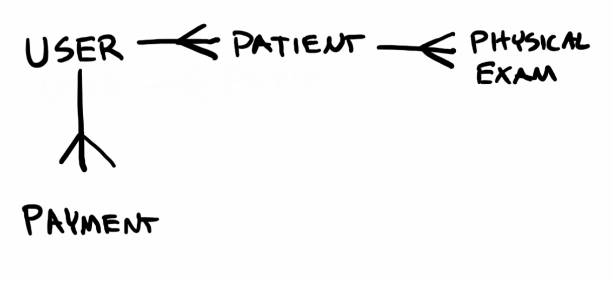

Front-End Repo: https://github.com/shaider0/clinical2020client
Deployed Client: https://shaider0.github.io/clinical2020client/#/

Clinical2020 is a case report form system that allows organizations involved in conducting clinical research to store clinical data collected from patients who participate in their studies.

#Technologies Used

-ReactJS: Front-end framework
-Express: Back-end framework
-NodeJS: JavaScript Runtime
-MongoDB: NoSQL Database
-Mongoose: Object Data Modeling

#How the App works

The current version of the application is an early prototype which gives users the ability to

1. Sign up
2. Sign in
3. Create a new patient
4. Enter information about a patient
5. View information entered about a patient
6. Edit previously entered information about a patient
7. Delete a patient
8. For a given patient, create a physical exam
9. Enter the results of the exam
10. View results of previous exams
11. Edit existing exams
12. Delete existing exams
13. Create a payment
14. Enter information about a payment
15. View previous payments
16. Edit existing payments
17. Delete existing payments

#Future Improvements

In future iterations, additional assessment types beyond physical exam will be added. Unsolved problems that will be addressed in future iterations include:
  -Using date as an input type (e.g., using MomentJS library) for all date data
  -Automatically calculating payments

#Planning, Process, and Problem-solving

1. Understand project requirements
2. Develop wireframes & user stories
3. Define entity relationships
4. Build & test back-end
5. Build and test front-end
6. Remove bugs
7. Improve UX & style
8. Complete documentation

#Set up and Installation

No additional setup necessary. Just sign up with a username and password, sign in, and you're good to go!
**Please use fake email addresses and passwords when using this application**

#Entity Relationship Diagram

#Routes and Methods 

| Verb        | URL Pattern           | Controller#Action  |
| ------------- |:-------------:| -----:|
| POST      | /sign-up | users#signup |
| POST      | /sign-in      |   users#signin |
| DELETE | /sign-out     |    users#signout |
| PATCH      | /change-password | users#changepw |
| GET      | /patients      |   patients#index |
| POST | /patients     |    patients#create |
| GET   | /patients/:id  | patients#show  |
| PATCH   | /patients/:id  | patients#update  |
| DELETE  | /patients/:id  | patients#destroy  |
| POST   | /patients/:id/physicals  | physicals#create  |
| GET   | /patients/:id/physicals  | physicals#index  |
| GET   | /patients/:id/physicals/:id  | physicals#show  |
| PATCH   | /patients/:id/physicals/:id  | physicals#update  |
| DELETE   | /patients/:id/physicals/:id  | physicals#destroy  |
| GET      | /payments      |   payments#index |
| POST | /payments     |    payments#create |
| GET   | /payments/:id  | payments#show  |
| PATCH   | /payments/:id  | payments#update  |
| DELETE  | /payments/:id  | payments#destroy  |

#Setup and Installation
N/A
